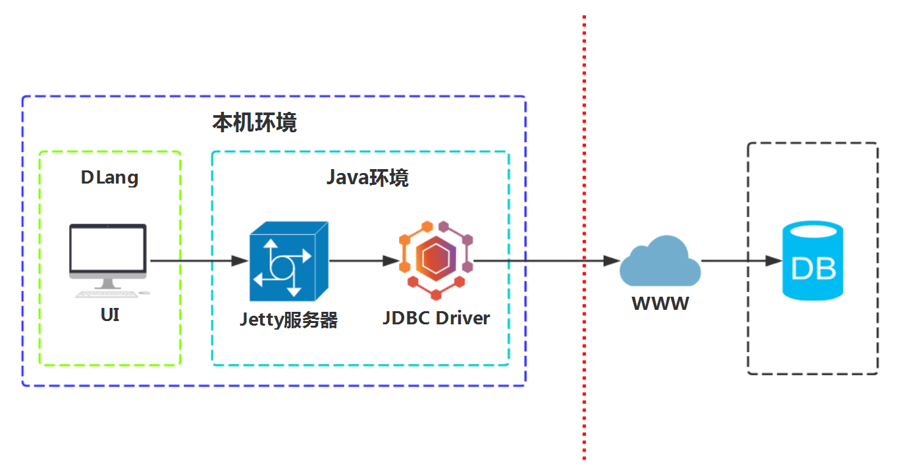

# DataHub

* ### Thanks
	* [DLang](https://dlang.org)
	* [SWT](http://www.eclipse.org/swt)
	* [DWT](https://code.dlang.org/packages/dwt) ([forum](https://forum.dlang.org/group/dwt))
	
	--------------------------
	
	* 架构图
	

* ### Base on 
	* DLang (<= v2.085.1)
	* DWT   (== v1.0.4_swt-3.4.1)

* ### 支持的数据库
  - [ ] MySQL
  - [ ] Oracle
  - [ ] SQLite
  - [ ] SQL Server
  - [ ] PostgreSQL

